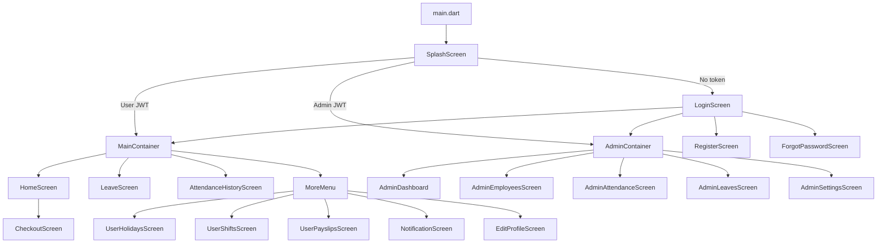
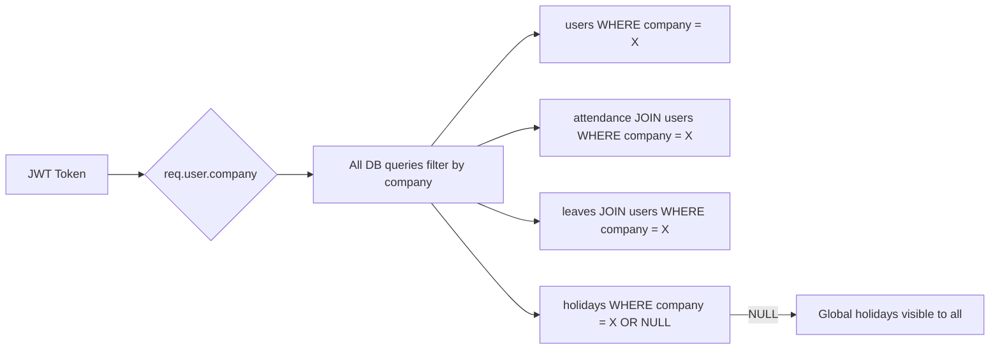
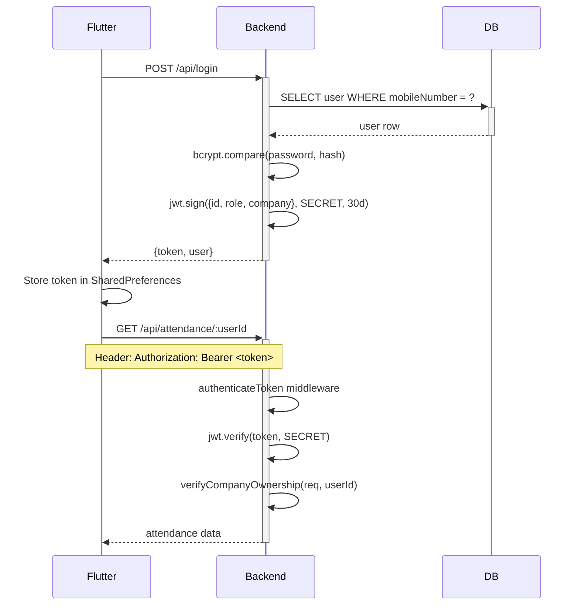
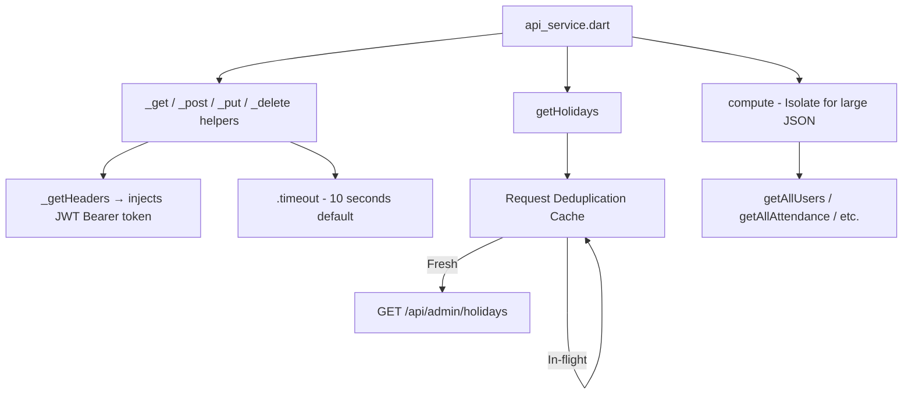
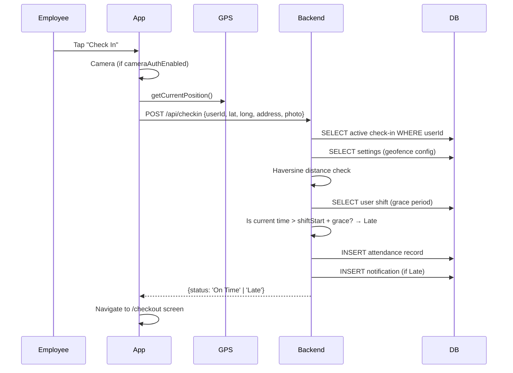

# Trackzo — Full App Architecture

## Tech Stack

| Layer | Technology |
|-------|-----------|
| Mobile App | Flutter (Dart) |
| State Management | Riverpod (`flutter_riverpod`) |
| Backend | Node.js + Express.js |
| Database | PostgreSQL |
| Authentication | JWT (30-day expiry) |
| File Storage | Local disk (`/uploads/`) via Multer |
| Maps | FlutterMap + OpenStreetMap (CartoDB tiles) |
| PDF Generation | `pdf` + `printing` packages |
| Image Caching | `cached_network_image` |

---

## System Overview

```mermaid
graph TD
    A[Flutter App] --HTTP/JWT--> B[Express.js REST API]
    B --SQL Queries--> C[(PostgreSQL Database)]
    B --File writes--> D[/uploads/ folder]
    A --Reads images--> D
    B --JWT Auth--> E[authenticateToken Middleware]
    E --> B
```

---

## Flutter App Structure

```
lib/
├── main.dart                    # App entry, route definitions, Riverpod ProviderScope
├── core/
│   ├── theme/
│   │   ├── pulse_colors.dart    # Color palette, gradients, shadows
│   │   └── pulse_text_styles.dart  # Typography system
│   ├── widgets/                 # Reusable UI components
│   │   ├── pulse_card.dart      # Glass/glow card widget
│   │   ├── pulse_button.dart    # Branded button
│   │   ├── pulse_shimmer.dart   # Loading skeleton
│   │   ├── pulse_empty_state.dart
│   │   └── pulse_scaffold.dart
│   └── providers/
│       └── branding_provider.dart  # Riverpod: live company theme/logo
├── screens/
│   ├── splash_screen.dart       # Auto-login check → route to admin/user
│   ├── login_screen.dart        # Login + biometric
│   ├── register_screen.dart     # New user registration
│   ├── forgot_password_screen.dart
│   ├── main_container.dart      # Employee bottom nav (Home/Leave/Attendance/More)
│   │
│   ├── home_screen.dart         # Dashboard: clock, check-in, stats, map
│   ├── attendance_history_screen.dart
│   ├── leave_screen.dart
│   ├── notification_screen.dart
│   ├── user_holidays_screen.dart
│   ├── user_shifts_screen.dart
│   ├── user_payslips_screen.dart
│   ├── edit_profile_screen.dart
│   ├── change_password_screen.dart
│   ├── checkout_screen.dart     # Check-out with selfie + GPS
│   │
│   └── admin/                   # Admin-only screens
│       ├── admin_dashboard_screen.dart
│       ├── admin_employees_screen.dart
│       ├── employee_form_screen.dart    # Create/Edit employee
│       ├── admin_attendance_screen.dart
│       ├── admin_absent_screen.dart
│       ├── admin_leaves_screen.dart
│       ├── admin_holidays_screen.dart
│       ├── admin_shifts_screen.dart
│       ├── admin_payroll_screen.dart
│       ├── admin_payslips_screen.dart
│       ├── admin_reports_screen.dart
│       ├── admin_notifications_screen.dart
│       └── admin_settings_screen.dart
└── services/
    ├── api_service.dart         # All HTTP calls to backend
    └── pdf_service.dart         # PDF generation (attendance + payslips)
```

---

## App Navigation Flow



---

## Database Schema (PostgreSQL — 11 Tables)

### `users`
| Column | Type | Notes |
|--------|------|-------|
| id | SERIAL PK | |
| fullName | TEXT | |
| email | TEXT UNIQUE | |
| mobileNumber | TEXT UNIQUE | |
| gender | TEXT | |
| password | TEXT | bcrypt hashed |
| role | TEXT | `'Admin'` or `'User'` |
| **company** | TEXT | **Multi-tenancy key** |
| department | TEXT | |
| salary | DOUBLE | |
| shiftId | INTEGER | FK → shifts.id |
| isActive | INTEGER | 0=deactivated, 1=active |
| isApproved | INTEGER | 0=pending, 1=approved |
| weekOffs | TEXT | e.g. `'Saturday,Sunday'` |
| biometricToken | TEXT | for biometric login |
| profilePicture | TEXT | path to uploaded file |

### `attendance`
| Column | Type | Notes |
|--------|------|-------|
| id | SERIAL PK | |
| userId | INTEGER | FK → users.id |
| checkInTime | TIMESTAMP | |
| checkInLat/Long | DOUBLE | GPS coordinates |
| checkInAddress | TEXT | Reverse geocoded |
| checkInPhoto | TEXT | Selfie path |
| checkOutTime | TIMESTAMP | NULL = still checked in |
| checkOutPhoto | TEXT | |
| status | TEXT | `'On Time'`, `'Late'` |
| minutesLate | INTEGER | |
| overtimeHours | DOUBLE | |
| isManual | INTEGER | 1 = admin added manually |

### `leaves`
| Column | Type | Notes |
|--------|------|-------|
| id | SERIAL PK | |
| userId | INTEGER | FK → users.id |
| leaveType | TEXT | e.g. Casual Leave |
| startDate / endDate | TEXT | `'YYYY-MM-DD'` |
| reason | TEXT | |
| status | TEXT | `'Pending'`, `'Approved'`, `'Rejected'`, `'Cancelled'` |
| rejectionReason | TEXT | |

### `leave_policies`
| Column | Type | Notes |
|--------|------|-------|
| id | SERIAL PK | |
| leaveType | TEXT | |
| daysPerYear | INTEGER | |
| isPaid | INTEGER | |
| company | TEXT | Multi-tenancy |
| UNIQUE | (leaveType, company) | |

### `leave_balances`
| Column | Type | Notes |
|--------|------|-------|
| id | SERIAL PK | |
| userId | INTEGER | |
| leaveType | TEXT | |
| totalDays | INTEGER | Admin override |
| UNIQUE | (userId, leaveType) | |

### `holidays`
| Column | Type | Notes |
|--------|------|-------|
| id | SERIAL PK | |
| name | TEXT | |
| date | TEXT | `'YYYY-MM-DD'` |
| type | TEXT | `'Public'`, `'Indian'`, `'Optional'` |
| duration | TEXT | `'Full Day'`, `'Half Day'` |
| company | TEXT | NULL = global holiday |

### `payslips`
| Column | Type | Notes |
|--------|------|-------|
| id | SERIAL PK | |
| userId | INTEGER | |
| company | TEXT | |
| month / year | INTEGER | |
| basicSalary | DOUBLE | |
| allowances / deductions | DOUBLE | |
| netSalary | DOUBLE | |

### `shifts`
| Column | Type | Notes |
|--------|------|-------|
| id | SERIAL PK | |
| name | TEXT | e.g. `'General Shift'` |
| startTime / endTime | TEXT | `'HH:MM'` |
| gracePeriodMins | INTEGER | Late threshold |
| overtimeRate | DOUBLE | e.g. `1.5x` |
| latePenaltyPerMin | DOUBLE | |
| company | TEXT | |

### `settings`
| Column | Type | Notes |
|--------|------|-------|
| id | SERIAL PK | |
| company | TEXT UNIQUE | |
| officeLat / officeLong | DOUBLE | Geofence center |
| officeRadiusMeters | DOUBLE | Default 100m |
| geofenceEnabled | INTEGER | 0=off, 1=on |
| payrollEnabled | INTEGER | |
| cameraAuthEnabled | INTEGER | |
| companyLogo | TEXT | Path |
| themeColor / secondaryColor / accentColor | TEXT | Hex colors |

### `notifications`
| Column | Type | Notes |
|--------|------|-------|
| id | SERIAL PK | |
| userId | INTEGER | |
| title / message | TEXT | |
| isRead | INTEGER | 0=unread, 1=read |

### `otps`
| Column | Type | Notes |
|--------|------|-------|
| id | SERIAL PK | |
| mobileNumber / email | TEXT | |
| otp | TEXT | Currently hardcoded `'9999'` |
| expiresAt | TIMESTAMP | 10 min expiry |

---

## Multi-Tenancy Design

Every record is scoped to a `company` identifier (a text slug like `"acme_corp"`).



**Company Provisioning:** First admin to register with a company ID triggers `provisionCompany()`:
- Creates default `settings` row
- Creates 3 default `shifts` (General, Evening, Night)
- Creates 10 default `leave_policies`

---

## Security Model



**Rate Limiting:** 100 requests / 15 minutes per IP (express-rate-limit)  
**Security Headers:** Helmet.js  
**File Upload:** Max 5MB, images only (Multer)

---

## API Layer Design



**Key patterns in `api_service.dart`:**
- All methods are `static` — no instance needed
- `_getHeaders()` auto-injects JWT from SharedPreferences
- `Future.wait()` used across all screens for parallel fetches
- `getHolidays()` uses request deduplication (shared in-flight future)
- Large list parsing uses `compute()` isolate to avoid UI jank
- All methods return **safe defaults** on failure — never throw to screens

---

## Check-In / Check-Out Flow



---

## Payroll Calculation Logic

```
Net Salary = Basic Salary
           + (Overtime Hours × Hourly Rate × Overtime Rate)
           - (Minutes Late × Penalty Per Minute)

Hourly Rate = Daily Salary / 8
Daily Salary = Monthly Salary / Working Days
```

Leave Balance accrues **monthly**:
```
Accrued = floor((daysPerYear / 12) × currentMonth)
```

---

## Performance Optimizations

| Optimization | Where |
|-------------|-------|
| `Future.wait()` — parallel API calls | All screens |
| `compute()` isolate — JSON parsing | Admin lists |
| Server-side SQL aggregation for stats | `/api/attendance/stats/:userId` |
| Request deduplication for holidays | `getHolidays()` |
| PostgreSQL indexes on userId, checkInTime, status, company | `init_pg.sql` |
| HTTP response compression | `compression` middleware |
| Connection pool (max 20) | PostgreSQL Pool |
| CachedNetworkImage for profile photos | Flutter |

---

## File Upload & Image Serving

```
Client POSTs multipart form → Multer saves to ./uploads/TIMESTAMP-filename.ext
Server returns path: "/uploads/filename.ext"
Flutter calls: ApiService.getImageUrl("/uploads/filename.ext")
→ Returns: "http://192.168.1.26:3000/uploads/filename.ext"
Express serves static: app.use('/uploads', express.static('./uploads'))
```

---

## Environment Configuration

| File | Used For |
|------|----------|
| `.env.development` | Local dev (PostgreSQL local) |
| `.env.staging` | Staging server |
| `.env.production` | Production |

Variables: `PGUSER`, `PGHOST`, `PGDATABASE`, `PGPASSWORD`, `PGPORT`, `JWT_SECRET`, `PORT`
